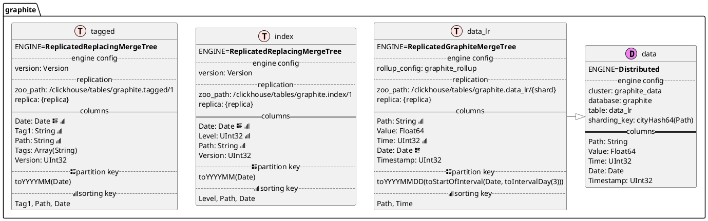
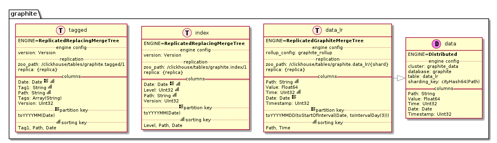

# PlantUML generator for ClickHouse tables

This is a very early version of diagrams generator. It parses `system.tables` table and produces [PlantUML](https://plantuml.com) diagrams source. Here's example of produced diagram:



And how it looks after running PlantUML:  


## Usage

```bash
python setup.py install
clickhouse-plantuml
```
